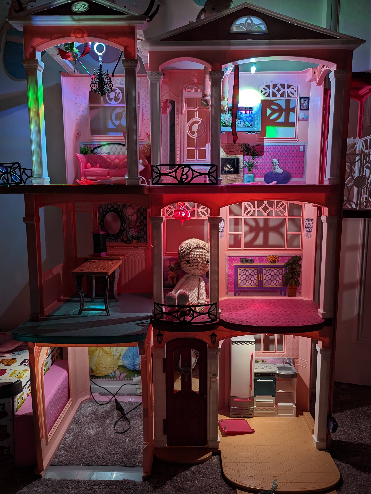

# **Doll House Disco**

This is a fun Arduino project I put together to add LED lights to my daughter's Barbie doll house.
It uses an Arduino Micro controller and 6 push buttons that control the 6 LED lights.

The push buttons functions, from top to buttom:
- turn on > switch modes > turn off. Holding it pressed for 3 seconds also turns it off
- turn on/off LEDs on Ground and 1st Floor
- turn on/off LEDs on 2nd Floor
- Red control for 2nd Floor RGB LEDs: press once to turn red on/off, hold pressed to gradually increase red
- Green control for 2nd Floor RGB LEDs: press once to turn green on/off, hold pressed to gradually increase green
- Blue control for 2nd Floor RGB LEDs: press once to turn blue on/off, hold pressed to gradually increase blue

The modes for the 2nd Floor RGB LEDs:
- fully on (R=255, G=255, B=255)
- [disco mode](./img/DHD1.mp4) randomly changing colours (3 speed modes: slow/medium/fast)
- holloween mode: flashing randomly 1-4 times

  
